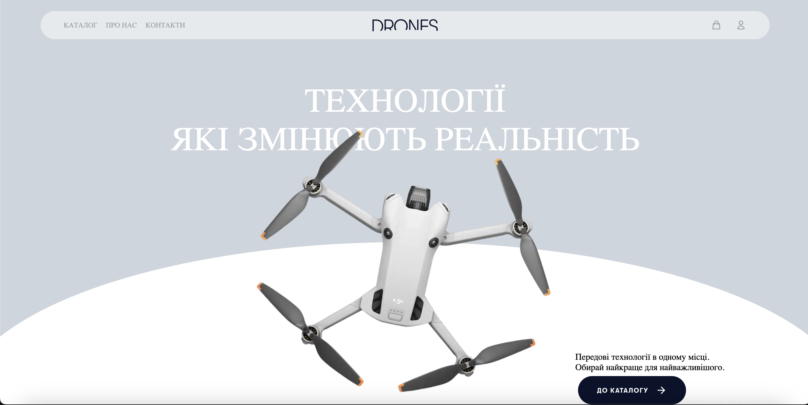

# Drone Shop

A full-stack e-commerce web application for selling drones, built with Flask using a modular Blueprint architecture. Browse the catalog, manage your cart, and check out — all backed by a real SQL database and user authentication.

-----

## 🎮 Demo




> *If running locally, the app starts at `http://127.0.0.1:5000`.*

-----

## ✨ Features

- 🛍 **Product catalog** — browse and search drones with details, prices, and images
- 🛒 **Shopping cart** — add, update, and remove items with persistent session state
- 👤 **User accounts** — registration, login, and session management via Flask-Login
- 💾 **Database-backed** — SQLAlchemy ORM with Alembic migrations
- 🧱 **Modular architecture** — each domain (shop, cart, user, home) lives in its own Flask Blueprint, making the codebase easy to extend
- 🎨 **Server-rendered UI** — Jinja2 templates with custom CSS and JavaScript for interactivity

-----

## 🛠 Tech Stack

|Layer   |Tools                                       |
|--------|--------------------------------------------|
|Backend |Python · Flask · Flask-Login · Flask-Migrate|
|Database|SQLAlchemy · Alembic                        |
|Frontend|Jinja2 · HTML · CSS · JavaScript            |
|Config  |python-dotenv                               |

-----

## 📂 Project Structure

```
Drone-Shop/
├── Project/          # App factory, config, and Blueprint registration
├── home/             # Landing page Blueprint
├── shop/             # Product catalog Blueprint
├── cart/             # Shopping cart Blueprint
├── user/             # Authentication and user account Blueprint
├── manage.py         # Entry point for running the app
├── requirements.txt
└── .gitignore
```

Each Blueprint contains its own routes, templates, and (where relevant) models — keeping concerns isolated and the project easy to navigate.

-----

## 🚀 Getting Started

### Prerequisites

- Python 3.10+
- pip

### Installation

```bash
# Clone the repo
git clone https://github.com/TymofiiZelenyi/Drone-Shop.git
cd Drone-Shop

# Create and activate a virtual environment
python -m venv venv
source venv/bin/activate          # macOS / Linux
# venv\Scripts\activate            # Windows

# Install dependencies
pip install -r requirements.txt

# Set up environment variables
cp .env.example .env              # then edit .env with your config

# Run database migrations
flask db upgrade

# Start the development server
python manage.py
```

The app will be available at **<http://127.0.0.1:5000>**.

-----

## 💡 What I Learned

- **Blueprint-based architecture in Flask** — implementing Django-style modular apps in a microframework, with each domain isolated in its own package
- **Working with SQLAlchemy** — designing relational models for products, users, and cart items; managing relationships and queries
- **Database migrations with Alembic** — evolving the schema safely as features grew
- **Session and authentication flows** — Flask-Login mechanics for protecting routes and managing user state
- **Trade-offs between Flask and Django** — Flask gives more architectural freedom but requires more upfront wiring; Django is faster to start but more opinionated

-----

## 👤 Author

**Tymofii Zelenyi** — [GitHub](https://github.com/TymofiiZelenyi)